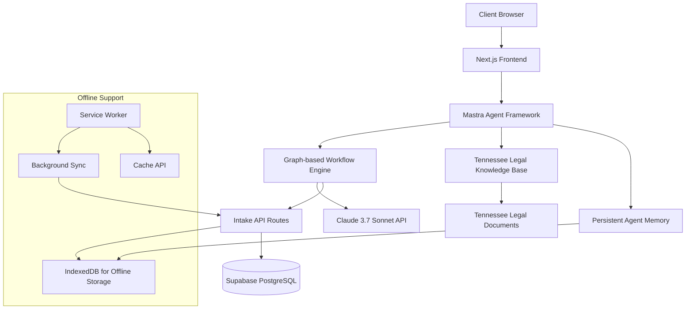

# Client Intake Form Implementation Guide: Mastra Integration

## Overview

This guide documents the implementation plan for the Tennessee Justice Bus client intake form system using the Mastra AI agent framework. The intake system will serve as the primary method for collecting client information before their Justice Bus consultation, helping to identify legal issues, gather relevant documentation, and prepare clients for their appointment.

## Table of Contents

1. [Introduction](#introduction)
2. [Architecture & Components](#architecture--components)
3. [Database Implementation](#database-implementation)
4. [UI Components](#ui-components)
5. [Implementation Phases](#implementation-phases)
6. [Technical Considerations](#technical-considerations)
7. [Testing Strategy](#testing-strategy)
8. [Success Metrics](#success-metrics)
9. [Next Steps](#next-steps)

## Introduction

This document outlines the implementation plan for the Tennessee Justice Bus client intake form system using the Mastra AI agent framework. The intake system will serve as the primary method for collecting client information before their Justice Bus consultation, helping to identify legal issues, gather relevant documentation, and prepare clients for their appointment.

Mastra is an open-source TypeScript agent framework that provides the primitives needed to build AI applications. Key features include:

- **Model routing**: Uses Vercel AI SDK for unified interface to multiple LLM providers
- **Agent capabilities**: Support for persistent memory and tool/function calling
- **Workflow engine**: Graph-based workflow system for deterministic LLM execution paths
- **RAG support**: APIs for document processing, chunking, embedding, and vector storage

## Architecture & Components



### Key Components:

1. **Intake Forms UI**

   - Progressive disclosure-based form system built with Shadcn UI components
   - Multi-step wizard interface with progress tracking
   - Responsive design for mobile and desktop devices
   - Offline-first implementation with local state persistence
   - Accessibility focused (WCAG 2.1 AA compliant)

2. **Mastra Agent Infrastructure**

   - TypeScript-native AI agent using Mastra framework
   - Integration with Claude 3.7 Sonnet for conversational interface
   - Persistent memory capabilities for maintaining context
   - Graph-based workflow engine for structured conversations
   - Integration with existing authentication and notification systems

3. **Tennessee Legal Knowledge Base**

   - Vector database containing Tennessee legal information
   - Document processing for knowledge retrieval
   - Integration with Mastra's RAG capabilities
   - Focus on civil legal needs (housing, family law, benefits, consumer issues)

4. **Offline Support Layer**

   - Enhanced service worker configuration for intake forms
   - Local storage of form state and responses
   - Background synchronization for completed forms
   - Cache API for storing legal information locally
   - IndexedDB for structured data storage

5. **API Layer**
   - RESTful endpoints for intake form submission and retrieval
   - Batch processing for offline-generated data
   - Integration with existing case management system
   - SMS notification triggers for form completion

## Database Implementation

The database schema has already been implemented in the Drizzle ORM setup with the following key tables:

- **cases**: Primary case information linking to users
- **intakeResponses**: Individual responses to intake questions linked to cases

We'll extend this with:

```typescript
// Schema additions for Mastra integration (to be implemented)
export const intakeWorkflows = pgTable("intake_workflows", {
  id: uuid("id").primaryKey().defaultRandom(),
  caseId: uuid("case_id")
    .notNull()
    .references(() => cases.id, { onDelete: "cascade" }),
  workflowType: varchar("workflow_type", { length: 100 }).notNull(),
  currentStep: varchar("current_step", { length: 100 }).notNull(),
  agentMemory: jsonb("agent_memory"),
  status: varchar("status", { length: 50 }).default("in_progress"),
  lastInteractionAt: timestamp("last_interaction_at", {
    withTimezone: true,
  }).defaultNow(),
  createdAt: timestamp("created_at", { withTimezone: true }).defaultNow(),
  updatedAt: timestamp("updated_at", { withTimezone: true }).defaultNow(),
});

export const legalKnowledgeBaseEntries = pgTable(
  "legal_knowledge_base_entries",
  {
    id: uuid("id").primaryKey().defaultRandom(),
    category: varchar("category", { length: 100 }).notNull(),
    subcategory: varchar("subcategory", { length: 100 }),
    title: varchar("title", { length: 255 }).notNull(),
    content: text("content").notNull(),
    vectorEmbedding: vector("vector_embedding", { dimensions: 1536 }),
    metadataJson: jsonb("metadata_json"),
    createdAt: timestamp("created_at", { withTimezone: true }).defaultNow(),
    updatedAt: timestamp("updated_at", { withTimezone: true }).defaultNow(),
  }
);
```

## UI Components

The intake form system will consist of the following UI components:

1. **IntakeWizard**: Master container component managing the overall intake flow
2. **IntakeStepNavigation**: Progress indicator and navigation controls
3. **ConversationalIntakeStep**: Mastra-powered conversational interface step
4. **StructuredFormStep**: Traditional form-based input step for structured data
5. **DocumentRequestStep**: Component for explaining and requesting specific documents
6. **IntakeSummary**: Summary view of collected information
7. **OfflineStatusIndicator**: Component showing sync status of intake data

## Implementation Phases

### Phase 1: Foundation & Basic Structure (Week 1)

1. Set up Mastra framework within Next.js application

   - Install Mastra via `pnpm create mastra@latest --components agents,tools,workflows --llm anthropic`
   - Configure API keys and environment variables
   - Create basic agent structure
   - Set up development environment with local agent playground

   ```typescript
   // .env file configuration
   ANTHROPIC_API_KEY = your_anthropic_api_key;

   // src/mastra/index.ts
   import { Mastra } from "@mastra/core";
   import { intakeAgent } from "./agents/intake";
   import { legalIntakeWorkflow } from "./workflows/intake";

   export const mastra = new Mastra({
     agents: { intakeAgent },
     workflows: { legalIntakeWorkflow },
   });
   ```

2. Create basic intake form routes and components

   - Implement `/intake` route with nested pages
   - Build core UI components for multi-step wizard
   - Set up form state management with React Hook Form
   - Implement Zod validation schemas for form data

3. Implement offline storage backbone
   - Enhance service worker for intake-specific caching
   - Set up IndexedDB stores for form data
   - Create utilities for background synchronization

### Phase 2: Mastra Agent Implementation (Week 2)

1. Design and implement intake conversation flow

   - Create graph-based workflow for intake process
   - Define branching logic for different legal issues
   - Implement persistent memory for maintaining context
   - Design system prompts for Claude 3.7 Sonnet

   ```typescript
   // src/mastra/agents/intake.ts
   import { Agent } from "@mastra/core/agent";
   import { anthropic } from "@ai-sdk/anthropic"; // For Claude integration
   import { z } from "zod";
   import { documentRequestTool, legalIssueTool } from "../tools";

   export const intakeAgent = new Agent({
     name: "Intake Assistant",
     instructions: `You are a legal intake assistant for the Tennessee Justice Bus.
     
     Your role is to help gather information from clients seeking legal assistance
     through the Justice Bus program. You should:
     
     1. Be empathetic and professional when interacting with clients
     2. Ask clear questions to identify their legal issues
     3. Request only relevant documentation based on their needs
     4. Flag urgent cases that need immediate attorney attention
     5. Never provide legal advice - only gather information
     6. Explain legal terminology in plain language
     7. Be mindful that clients may have limited connectivity
   
     Always maintain client confidentiality and privacy.`,
     model: anthropic("claude-3-sonnet-20240229"), // Using Claude 3.7 Sonnet
     tools: {
       documentRequestTool,
       legalIssueTool,
     },
   });

   // src/mastra/workflows/intake.ts
   import { Workflow, Step } from "@mastra/core/workflow";
   import { z } from "zod";

   export const legalIntakeWorkflow = new Workflow({
     name: "legal-intake",
     triggerSchema: z.object({
       userId: z.string(),
       caseId: z.string().optional(),
     }),
   });

   const initialAssessment = new Step({
     id: "initialAssessment",
     outputSchema: z.object({
       legalIssueType: z.string(),
       urgencyLevel: z.number(),
       needsAttorney: z.boolean(),
     }),
     execute: async ({ context }) => {
       // Implementation here
       return {
         legalIssueType: "housing",
         urgencyLevel: 3,
         needsAttorney: false,
       };
     },
   });

   const detailedIntake = new Step({
     id: "detailedIntake",
     execute: async ({ context }) => {
       const initialResult = context.getStepResult(initialAssessment);
       // Implement detailed questioning based on legal issue type
       return {
         detailedQuestions: ["When did you receive the eviction notice?"],
         requiredDocuments: ["Lease agreement", "Eviction notice"],
       };
     },
   });

   // Link steps in the workflow with branching logic
   legalIntakeWorkflow
     .step(initialAssessment)
     .then(({ result }) => {
       if (result.needsAttorney) {
         return "attorneyReview";
       }
       return "detailedIntake";
     })
     .commit();
   ```

2. Build Tennessee legal knowledge base

   - Collect and process Tennessee legal information
   - Implement vector database integration
   - Create RAG capabilities for knowledge retrieval
   - Set up utilities for embedding and retrieval

   ```typescript
   // src/mastra/rag/index.ts
   import { MDocument } from "@mastra/rag";
   import { PgVector } from "@mastra/pg"; // Using pgvector with our PostgreSQL database
   import { embedMany } from "ai";
   import { anthropic } from "@ai-sdk/anthropic";

   // Database connection (using our existing Supabase PostgreSQL)
   const pgVector = new PgVector(process.env.POSTGRES_CONNECTION_STRING);

   // Process a Tennessee legal document
   export async function processLegalDocument(content, metadata) {
     // Create document from content
     const legalDocument = MDocument.fromText(content, metadata);

     // Chunk the document using recursive strategy
     const chunks = await legalDocument.chunk({
       strategy: "recursive",
       size: 512,
       overlap: 50,
     });

     // Generate embeddings using Claude's embedding model
     const { embeddings } = await embedMany({
       values: chunks.map((chunk) => chunk.text),
       model: anthropic.embedding("claude-3-embedding"),
     });

     // Store in vector database with metadata
     await pgVector.upsert({
       indexName: "legal_knowledge",
       vectors: embeddings.map((embedding, i) => ({
         id: `chunk-${Date.now()}-${i}`,
         values: embedding,
         metadata: {
           ...chunks[i].metadata,
           text: chunks[i].text.substring(0, 100) + "...",
         },
       })),
     });

     return {
       chunkCount: chunks.length,
       status: "success",
     };
   }

   // Query the knowledge base
   export async function queryLegalKnowledge(question) {
     // Generate embedding for the query
     const { embeddings } = await embedMany({
       values: [question],
       model: anthropic.embedding("claude-3-embedding"),
     });

     // Query for similar chunks
     const results = await pgVector.query({
       indexName: "legal_knowledge",
       queryVector: embeddings[0],
       topK: 5,
     });

     return results;
   }
   ```

3. Implement human-in-the-loop functionality
   - Create attorney review interface
   - Set up notification system for escalations
   - Implement workflow suspension and resumption
   - Build feedback mechanisms for attorneys

### Phase 3: Integration & Testing (Week 3)

1. Connect Mastra agent to UI components

   - Integrate conversational interface with wizard UI
   - Implement state persistence between steps
   - Create document request and upload functionality
   - Build summary generation capabilities

2. Implement comprehensive offline support

   - Enhance background sync for complex form data
   - Implement optimistic UI updates
   - Create robust error handling for sync failures
   - Test in various connectivity scenarios

3. Add final polish and enhancements
   - Implement comprehensive accessibility testing
   - Add animation and transition effects
   - Optimize performance for mobile devices
   - Create comprehensive error states and recovery mechanisms

## Technical Considerations

1. **Offline Functionality**

   - The intake system must function completely offline with full functionality
   - All required legal information should be cached locally
   - Form submissions must be queued for background sync
   - User state and progress must persist across browser restarts

2. **Privacy & Security**

   - Sensitive client information requires end-to-end encryption
   - Clear data retention policies must be implemented
   - Local storage should be properly secured
   - Compliance with legal data handling requirements

3. **AI Boundaries**

   - Clear demarcation between information and legal advice
   - System prompts must include appropriate disclaimers
   - Human review for complex or edge cases
   - Audit trail of AI-generated content

4. **Performance**

   - Optimize bundle size for rural connectivity
   - Implement lazy loading for non-critical components
   - Minimize API calls with intelligent caching
   - Consider low-end device performance

5. **Cost Optimization**

   - **Tiered Model Strategy**

     - Use Claude 3 Haiku for initial intake screening and simpler tasks
     - Reserve Claude 3.7 Sonnet for complex legal issue identification and advanced reasoning
     - Implement automatic model switching based on task complexity and requirements
     - Example implementation:

     ```typescript
     // src/mastra/utils/model-selector.ts
     import { anthropic } from "@ai-sdk/anthropic";

     export enum ComplexityLevel {
       BASIC = "basic", // Simple Q&A, form filling
       INTERMEDIATE = "intermediate", // Document analysis, summarization
       COMPLEX = "complex", // Legal reasoning, issue spotting
     }

     export function selectModelByComplexity(level: ComplexityLevel) {
       switch (level) {
         case ComplexityLevel.BASIC:
           return anthropic("claude-3-haiku-20240307");
         case ComplexityLevel.INTERMEDIATE:
           return anthropic("claude-3-5-sonnet-20240620"); // Use Opus version if needed
         case ComplexityLevel.COMPLEX:
           return anthropic("claude-3-sonnet-20240229");
         default:
           return anthropic("claude-3-haiku-20240307"); // Default to the most cost-effective
       }
     }

     export function determineComplexity(
       task: string,
       contextLength: number
     ): ComplexityLevel {
       // Simple logic to determine complexity based on task description and context length
       const legalTerms = [
         "eviction",
         "custody",
         "bankruptcy",
         "foreclosure",
         "lawsuit",
       ];

       // If the context is very large, might need a model with larger context window
       if (contextLength > 10000) {
         return ComplexityLevel.COMPLEX;
       }

       // Check if the task involves complex legal concepts
       const containsLegalTerms = legalTerms.some((term) =>
         task.toLowerCase().includes(term)
       );
       if (containsLegalTerms) {
         return ComplexityLevel.COMPLEX;
       }

       // Check for basic info gathering
       if (
         task.includes("gather") ||
         task.includes("collect") ||
         task.includes("basic info")
       ) {
         return ComplexityLevel.BASIC;
       }

       // Default to intermediate for general cases
       return ComplexityLevel.INTERMEDIATE;
     }
     ```

   - **Context Window Management**

     - Implement a sliding context window that retains only the most relevant conversation history
     - Use summary techniques to compress long interactions into concise context
     - Create a metadata-based retrieval system that only pulls in relevant case history
     - Example compression strategy:

     ```typescript
     // src/mastra/utils/context-optimizer.ts
     import { Agent } from "@mastra/core/agent";
     import { anthropic } from "@ai-sdk/anthropic";

     const summarizationAgent = new Agent({
       name: "Context Summarizer",
       instructions:
         "Summarize the conversation history in a concise way, focusing only on key information relevant to the client's legal issue. Include only factual information, essential dates, and critical case details. Omit pleasantries, redundant information, and tangential discussions.",
       model: anthropic("claude-3-haiku-20240307"), // Use economical model for summarization
     });

     export async function optimizeConversationContext(
       messages: Message[],
       maxTokens: number = 2000
     ) {
       // If conversation is still small, return as is
       if (estimateTokenCount(messages) <= maxTokens) {
         return messages;
       }

       // Extract the last few messages which we'll keep intact
       const recentMessages = messages.slice(-3);
       const olderMessages = messages.slice(0, -3);

       // Summarize the older portion of the conversation
       const conversationText = olderMessages
         .map((m) => `${m.role}: ${m.content}`)
         .join("\n\n");

       const summary = await summarizationAgent.generate([
         {
           role: "user",
           content: `Summarize this conversation: \n\n${conversationText}`,
         },
       ]);

       // Create a new message with the summary
       const summaryMessage = {
         role: "system",
         content: `Previous conversation summary: ${summary.text}`,
       };

       // Return the summary followed by the recent messages
       return [summaryMessage, ...recentMessages];
     }

     function estimateTokenCount(messages: Message[]): number {
       // Rough estimation: 1 token ≈ 4 characters for English text
       return messages.reduce((count, message) => {
         return count + message.content.length / 4;
       }, 0);
     }
     ```

   - **Prompt Engineering Optimizations**

     - Craft focused system prompts that achieve goals with minimal token usage
     - Implement field-specific templates that reduce repetitive instructions
     - Use parameter tuning (temperature, top-p) to get more precise answers with fewer tokens
     - Best practices:
       - Favor direct, concise instructions over verbose explanations
       - Use bullet points instead of paragraphs when possible
       - Implement domain-specific instructions only when needed
       - Remove redundant examples and explanations from prompts

   - **Caching & Reuse Strategy**

     - Cache common legal definitions, procedures, and responses locally
     - Implement deterministic prompting to increase cache hit rates
     - Store and reuse embeddings for frequently accessed legal documents
     - Example caching implementation:

     ```typescript
     // src/mastra/utils/response-cache.ts
     import { createHash } from "crypto";

     interface CacheEntry {
       response: string;
       timestamp: number;
       tokensSaved: number;
     }

     // In-memory cache for development, would use Redis/KV in production
     const responseCache: Map<string, CacheEntry> = new Map();

     export async function getCachedOrGenerateResponse(
       agent: Agent,
       messages: Message[],
       cacheTTL: number = 24 * 60 * 60 * 1000 // 24 hours default
     ) {
       // Create a deterministic key from the messages
       const cacheKey = createCacheKey(messages);

       // Check if we have a valid cache entry
       const cachedEntry = responseCache.get(cacheKey);
       if (cachedEntry && Date.now() - cachedEntry.timestamp < cacheTTL) {
         // Log metrics for monitoring cache effectiveness
         recordCacheHit(cachedEntry.tokensSaved);
         return cachedEntry.response;
       }

       // Generate new response if no cache hit
       const response = await agent.generate(messages);

       // Estimate tokens saved for future cache hits
       const tokensSaved =
         estimateTokenCount(messages) +
         estimateTokenCount([
           {
             role: "assistant",
             content: response.text,
           },
         ]);

       // Store in cache
       responseCache.set(cacheKey, {
         response: response.text,
         timestamp: Date.now(),
         tokensSaved,
       });

       return response.text;
     }

     function createCacheKey(messages: Message[]): string {
       // Create a deterministic hash from the messages
       const messagesString = JSON.stringify(messages);
       return createHash("sha256").update(messagesString).digest("hex");
     }

     function recordCacheHit(tokensSaved: number) {
       // Record metrics for monitoring (would connect to monitoring system)
       console.log(`Cache hit saved approximately ${tokensSaved} tokens`);
     }
     ```

   - **Usage Monitoring & Analytics**
     - Implement a token usage dashboard in the admin interface
     - Set up per-case and per-category token budgets with alerts
     - Create analytics to identify optimization opportunities
     - Track key metrics:
       - Tokens per intake completion
       - Cache hit rates
       - Cost per legal issue type
       - Token savings from context optimization
       - Model distribution (% of requests using each model tier)

## Testing Strategy

1. **Unit Tests**

   - Test individual UI components
   - Validate form state management
   - Test offline storage utilities
   - Verify Mastra agent functions

2. **Integration Tests**

   - Test end-to-end form submission flow
   - Validate offline/online transitions
   - Test background synchronization
   - Verify data consistency

3. **Accessibility Testing**

   - Automated testing with Axe
   - Manual testing with screen readers
   - Keyboard navigation testing
   - Color contrast verification

4. **Connectivity Testing**
   - Simulate various network conditions
   - Test complete offline usage
   - Verify data integrity during sync
   - Test recovery from connection failures

## Success Metrics

1. Successful completion of intake forms offline and online
2. Accurate legal issue identification through the AI agent
3. Proper document requests based on case type
4. Successful synchronization when connectivity is restored
5. Positive attorney feedback on intake quality
6. Client satisfaction with the intake process

## Next Steps

1. Install and configure Mastra framework with specific options:

   ```
   pnpm create mastra@latest --components agents,tools,workflows --llm anthropic
   ```

2. Create initial workflow diagram for intake process
3. Begin building basic UI components for intake wizard
4. Develop offline storage backbone for intake data
5. Set up environment variables for Claude API integration

---

This guide is maintained by the Tennessee Justice Bus development team. Last updated: April 12, 2025.
