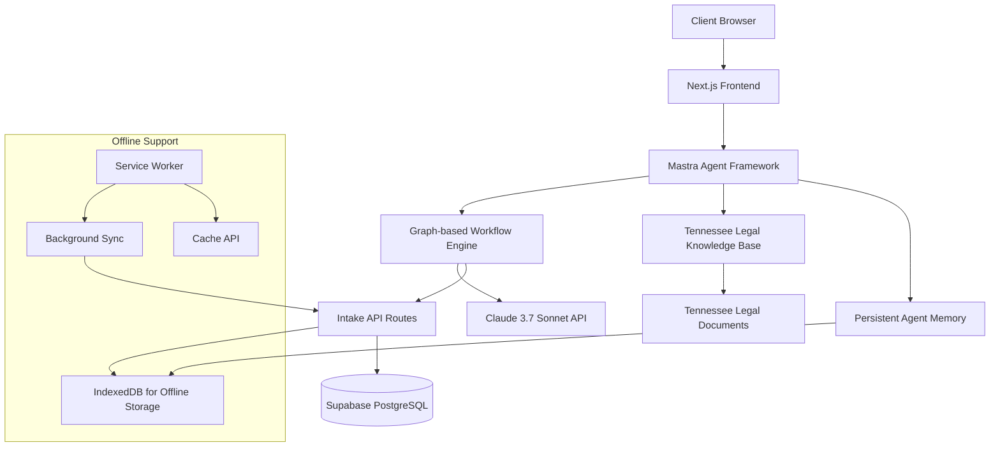

# Client Intake Form Implementation Guide: Mastra Integration

## Overview

This guide documents the implementation plan for the Tennessee Justice Bus client intake form system using the Mastra AI agent framework. The intake system will serve as the primary method for collecting client information before their Justice Bus consultation, helping to identify legal issues, gather relevant documentation, and prepare clients for their appointment.

## Table of Contents

1. [Introduction](#introduction)
2. [Architecture & Components](#architecture--components)
3. [Database Implementation](#database-implementation)
4. [UI Components](#ui-components)
5. [Implementation Phases](#implementation-phases)
6. [Technical Considerations](#technical-considerations)
7. [Testing Strategy](#testing-strategy)
8. [Success Metrics](#success-metrics)
9. [Next Steps](#next-steps)

## Introduction

This document outlines the implementation plan for the Tennessee Justice Bus client intake form system using the Mastra AI agent framework. The intake system will serve as the primary method for collecting client information before their Justice Bus consultation, helping to identify legal issues, gather relevant documentation, and prepare clients for their appointment.

## Architecture & Components



### Key Components:

1. **Intake Forms UI**

   - Progressive disclosure-based form system built with Shadcn UI components
   - Multi-step wizard interface with progress tracking
   - Responsive design for mobile and desktop devices
   - Offline-first implementation with local state persistence
   - Accessibility focused (WCAG 2.1 AA compliant)

2. **Mastra Agent Infrastructure**

   - TypeScript-native AI agent using Mastra framework
   - Integration with Claude 3.7 Sonnet for conversational interface
   - Persistent memory capabilities for maintaining context
   - Graph-based workflow engine for structured conversations
   - Integration with existing authentication and notification systems

3. **Tennessee Legal Knowledge Base**

   - Vector database containing Tennessee legal information
   - Document processing for knowledge retrieval
   - Integration with Mastra's RAG capabilities
   - Focus on civil legal needs (housing, family law, benefits, consumer issues)

4. **Offline Support Layer**

   - Enhanced service worker configuration for intake forms
   - Local storage of form state and responses
   - Background synchronization for completed forms
   - Cache API for storing legal information locally
   - IndexedDB for structured data storage

5. **API Layer**
   - RESTful endpoints for intake form submission and retrieval
   - Batch processing for offline-generated data
   - Integration with existing case management system
   - SMS notification triggers for form completion

## Database Implementation

The database schema has already been implemented in the Drizzle ORM setup with the following key tables:

- **cases**: Primary case information linking to users
- **intakeResponses**: Individual responses to intake questions linked to cases

We'll extend this with:

```typescript
// Schema additions for Mastra integration (to be implemented)
export const intakeWorkflows = pgTable("intake_workflows", {
  id: uuid("id").primaryKey().defaultRandom(),
  caseId: uuid("case_id")
    .notNull()
    .references(() => cases.id, { onDelete: "cascade" }),
  workflowType: varchar("workflow_type", { length: 100 }).notNull(),
  currentStep: varchar("current_step", { length: 100 }).notNull(),
  agentMemory: jsonb("agent_memory"),
  status: varchar("status", { length: 50 }).default("in_progress"),
  lastInteractionAt: timestamp("last_interaction_at", {
    withTimezone: true,
  }).defaultNow(),
  createdAt: timestamp("created_at", { withTimezone: true }).defaultNow(),
  updatedAt: timestamp("updated_at", { withTimezone: true }).defaultNow(),
});

export const legalKnowledgeBaseEntries = pgTable(
  "legal_knowledge_base_entries",
  {
    id: uuid("id").primaryKey().defaultRandom(),
    category: varchar("category", { length: 100 }).notNull(),
    subcategory: varchar("subcategory", { length: 100 }),
    title: varchar("title", { length: 255 }).notNull(),
    content: text("content").notNull(),
    vectorEmbedding: vector("vector_embedding", { dimensions: 1536 }),
    metadataJson: jsonb("metadata_json"),
    createdAt: timestamp("created_at", { withTimezone: true }).defaultNow(),
    updatedAt: timestamp("updated_at", { withTimezone: true }).defaultNow(),
  }
);
```

## UI Components

The intake form system will consist of the following UI components:

1. **IntakeWizard**: Master container component managing the overall intake flow
2. **IntakeStepNavigation**: Progress indicator and navigation controls
3. **ConversationalIntakeStep**: Mastra-powered conversational interface step
4. **StructuredFormStep**: Traditional form-based input step for structured data
5. **DocumentRequestStep**: Component for explaining and requesting specific documents
6. **IntakeSummary**: Summary view of collected information
7. **OfflineStatusIndicator**: Component showing sync status of intake data

## Implementation Phases

### Phase 1: Foundation & Basic Structure (Week 1)

1. Set up Mastra framework within Next.js application

   - Install Mastra via `pnpm create mastra`
   - Configure API keys and environment variables
   - Create basic agent structure
   - Set up development environment with local agent playground

2. Create basic intake form routes and components

   - Implement `/intake` route with nested pages
   - Build core UI components for multi-step wizard
   - Set up form state management with React Hook Form
   - Implement Zod validation schemas for form data

3. Implement offline storage backbone
   - Enhance service worker for intake-specific caching
   - Set up IndexedDB stores for form data
   - Create utilities for background synchronization

### Phase 2: Mastra Agent Implementation (Week 2)

1. Design and implement intake conversation flow

   - Create graph-based workflow for intake process
   - Define branching logic for different legal issues
   - Implement persistent memory for maintaining context
   - Design system prompts for Claude 3.7 Sonnet

2. Build Tennessee legal knowledge base

   - Collect and process Tennessee legal information
   - Implement vector database integration
   - Create RAG capabilities for knowledge retrieval
   - Set up utilities for embedding and retrieval

3. Implement human-in-the-loop functionality
   - Create attorney review interface
   - Set up notification system for escalations
   - Implement workflow suspension and resumption
   - Build feedback mechanisms for attorneys

### Phase 3: Integration & Testing (Week 3)

1. Connect Mastra agent to UI components

   - Integrate conversational interface with wizard UI
   - Implement state persistence between steps
   - Create document request and upload functionality
   - Build summary generation capabilities

2. Implement comprehensive offline support

   - Enhance background sync for complex form data
   - Implement optimistic UI updates
   - Create robust error handling for sync failures
   - Test in various connectivity scenarios

3. Add final polish and enhancements
   - Implement comprehensive accessibility testing
   - Add animation and transition effects
   - Optimize performance for mobile devices
   - Create comprehensive error states and recovery mechanisms

## Technical Considerations

1. **Offline Functionality**

   - The intake system must function completely offline with full functionality
   - All required legal information should be cached locally
   - Form submissions must be queued for background sync
   - User state and progress must persist across browser restarts

2. **Privacy & Security**

   - Sensitive client information requires end-to-end encryption
   - Clear data retention policies must be implemented
   - Local storage should be properly secured
   - Compliance with legal data handling requirements

3. **AI Boundaries**

   - Clear demarcation between information and legal advice
   - System prompts must include appropriate disclaimers
   - Human review for complex or edge cases
   - Audit trail of AI-generated content

4. **Performance**
   - Optimize bundle size for rural connectivity
   - Implement lazy loading for non-critical components
   - Minimize API calls with intelligent caching
   - Consider low-end device performance

## Testing Strategy

1. **Unit Tests**

   - Test individual UI components
   - Validate form state management
   - Test offline storage utilities
   - Verify Mastra agent functions

2. **Integration Tests**

   - Test end-to-end form submission flow
   - Validate offline/online transitions
   - Test background synchronization
   - Verify data consistency

3. **Accessibility Testing**

   - Automated testing with Axe
   - Manual testing with screen readers
   - Keyboard navigation testing
   - Color contrast verification

4. **Connectivity Testing**
   - Simulate various network conditions
   - Test complete offline usage
   - Verify data integrity during sync
   - Test recovery from connection failures

## Success Metrics

1. Successful completion of intake forms offline and online
2. Accurate legal issue identification through the AI agent
3. Proper document requests based on case type
4. Successful synchronization when connectivity is restored
5. Positive attorney feedback on intake quality
6. Client satisfaction with the intake process

## Next Steps

1. Install and configure Mastra framework
2. Create initial workflow diagram for intake process
3. Begin building basic UI components for intake wizard
4. Develop offline storage backbone for intake data

---

This guide is maintained by the Tennessee Justice Bus development team. Last updated: April 12, 2025.
