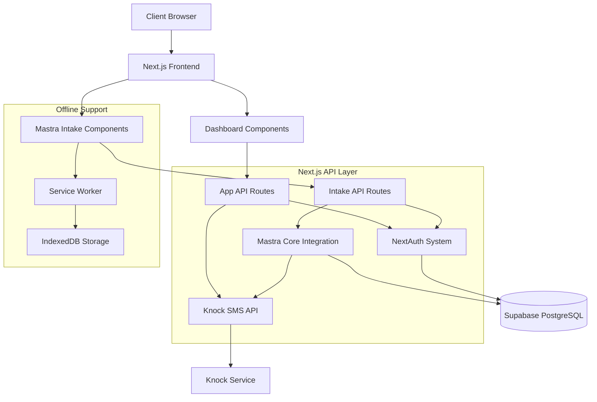

# Mastra System Integration Guide: Tennessee Justice Bus

## Overview

This guide documents how the Mastra AI agent framework will be integrated with existing systems in the Tennessee Justice Bus application. Proper system integration is critical for ensuring the intake process works seamlessly with our authentication, notification, case management, and dashboard reporting systems.

## Table of Contents

1. [Introduction](#introduction)
2. [Architectural Overview](#architectural-overview)
3. [Knock SMS Integration](#knock-sms-integration)
4. [NextAuth Integration](#nextauth-integration)
5. [Case Management Linkage](#case-management-linkage)
6. [Dashboard Reporting](#dashboard-reporting)
7. [Offline Support](#offline-support)
8. [Security Considerations](#security-considerations)
9. [Testing Strategy](#testing-strategy)
10. [Next Steps](#next-steps)

## Introduction

The Tennessee Justice Bus intake system uses Mastra to provide AI-enhanced client intake, but rather than operating as a standalone service, Mastra will be fully integrated with our existing Next.js application architecture. This integration approach ensures:

- Unified codebase and deployment
- Consistent authentication and authorization
- Seamless offline experience
- Integrated monitoring and analytics
- Cost-effective operation

## Architectural Overview



## Knock SMS Integration

Mastra will integrate with our existing Knock notification system to trigger SMS messages at key points in the intake workflow. This integration is vital for client communication, especially in rural areas where SMS may be more reliable than internet connectivity.

### Implementation Details

```typescript
// src/mastra/tools/notification-tool.ts
import { createTool } from "@mastra/core/tools";
import { z } from "zod";
import { triggerNotification } from "../../lib/knock";

export const notificationTool = createTool({
  id: "send-notification",
  description: "Send notification to client or attorney",
  inputSchema: z.object({
    recipientId: z.string().describe("User ID of the recipient"),
    notificationType: z.enum([
      "appointment-reminder",
      "document-request",
      "status-update",
      "attorney-referral",
    ]),
    message: z.string().describe("Custom message content"),
    priority: z.enum(["normal", "urgent"]).default("normal"),
  }),
  execute: async ({ recipientId, notificationType, message, priority }) => {
    // Convert to our Knock workflow identifier
    const workflowKey = `intake-${notificationType}`;

    try {
      const result = await triggerNotification({
        userId: recipientId,
        workflowKey,
        data: {
          message,
          priority,
          source: "mastra-agent",
          timestamp: new Date().toISOString(),
        },
      });

      return {
        success: true,
        notificationId: result.id,
      };
    } catch (error) {
      // Handle offline case - queue for later
      if (!navigator.onLine) {
        // Add to our existing offline queue system
        await queueOfflineNotification({
          userId: recipientId,
          workflowKey,
          data: { message, priority, source: "mastra-agent" },
        });

        return {
          success: true,
          queued: true,
          message: "Notification queued for delivery when online",
        };
      }

      throw error;
    }
  },
});
```

### Notification Workflows for Intake

The following Knock workflows will be triggered by the Mastra agent:

1. **Document Request Notification**

   - Triggered when the agent determines specific documents are needed
   - Message content specifies document types and reasoning
   - Can include document submission instructions and links

2. **Status Update Notification**

   - Communicates intake progress and next steps
   - Used for long-running intake processes that span multiple sessions
   - Provides clear context on where the client left off

3. **Attorney Referral Notification**

   - Triggered when a case is flagged for urgent attorney review
   - Sent to both client and available attorneys
   - Includes case summary and urgency level

4. **Appointment Reminder Notification**
   - Leverages existing appointment reminder system
   - Enhanced with case-specific context from the intake process
   - Can include personalized preparation instructions

## NextAuth Integration

Mastra agents and workflows will be integrated with our NextAuth authentication system to ensure proper access control and user context.

### Implementation Details

```typescript
// src/mastra/middlewares/auth-context.ts
import { NextRequest, NextResponse } from "next/server";
import { getToken } from "next-auth/jwt";

export async function mastraAuthMiddleware(
  req: NextRequest,
  { params }: { params: { agentId: string } }
) {
  // Get the user's session token
  const token = await getToken({ req });

  if (!token) {
    return NextResponse.json(
      { error: "Authentication required" },
      { status: 401 }
    );
  }

  // Add user context to Mastra container
  const container = new Container();
  container.set("userId", token.sub);
  container.set("userEmail", token.email);
  container.set("userPhone", token.phone);
  container.set("userRoles", token.roles || []);

  // Continue to the Mastra handler with the container
  return NextResponse.next({
    headers: {
      "x-mastra-container": JSON.stringify(container.serialize()),
    },
  });
}

// src/app/api/mastra/[...path]/route.ts
import { mastraAuthMiddleware } from "@/mastra/middlewares/auth-context";
import { NextRequest } from "next/server";
import { mastra } from "@/mastra";

export const middleware = mastraAuthMiddleware;

export async function POST(
  req: NextRequest,
  { params }: { params: { path: string[] } }
) {
  const [resource, id, action] = params.path;

  // Handle various Mastra endpoints
  if (resource === "agents" && id && action === "generate") {
    const container = JSON.parse(req.headers.get("x-mastra-container") || "{}");
    const agent = await mastra.getAgent(id);

    const body = await req.json();
    const response = await agent.generate(body.messages, {
      container,
      maxSteps: body.maxSteps || 5,
    });

    return Response.json(response);
  }

  // Handle other endpoints (workflows, etc.)

  return Response.json({ error: "Not implemented" }, { status: 501 });
}
```

### Offline Authentication Support

For offline operation, Mastra will leverage our existing JWT-based offline authentication:

1. **Token Storage**

   - Authentication tokens are stored in secure localStorage
   - Tokens include user ID, email, phone, and creation timestamp
   - 30-day token lifetime supports extended offline usage

2. **Context Hydration**
   - When offline, Mastra agents receive user context from stored tokens
   - Agents can access token claims for personalization and authorization
   - Role-based access control remains enforced even offline

## Case Management Linkage

Mastra will be integrated with our case management system to update case records based on intake findings and trigger appropriate workflows.

### Implementation Details

```typescript
// src/mastra/tools/case-management-tool.ts
import { createTool } from "@mastra/core/tools";
import { z } from "zod";
import { db } from "../../lib/db";
import { cases, intakeResponses } from "../../db/schema";
import { eq } from "drizzle-orm";

export const caseManagementTool = createTool({
  id: "update-case",
  description: "Update case information based on intake conversation",
  inputSchema: z.object({
    caseId: z.string(),
    legalIssueType: z.string().optional(),
    urgencyLevel: z.number().min(1).max(5).optional(),
    requiredDocuments: z.array(z.string()).optional(),
    notes: z.string().optional(),
    referToAttorney: z.boolean().default(false),
  }),
  execute: async ({ context, caseId, ...caseData }) => {
    // Get user ID from container
    const userId = context.container.get("userId");

    // Update case data
    await db
      .update(cases)
      .set({
        ...caseData,
        updatedAt: new Date(),
        lastUpdatedBy: "mastra-agent",
      })
      .where(eq(cases.id, caseId));

    // If attorney referral is needed, trigger that workflow
    if (caseData.referToAttorney) {
      await triggerAttorneyReferral(caseId, userId);
    }

    return {
      success: true,
      caseId,
      updatedFields: Object.keys(caseData),
    };
  },
});
```

### Case Management Integration Workflows

The following case management workflows will be triggered by the Mastra agent:

1. **Case Creation**

   - If a new legal issue is identified during intake, create a new case
   - Assign appropriate metadata like issue type, priority, and location
   - Link to the user's profile and any existing cases

2. **Document Association**

   - When documents are uploaded, associate them with the case
   - Add metadata about document type and relevance
   - Trigger document OCR and analysis as needed

3. **Attorney Assignment**
   - Match cases with attorneys based on expertise and location
   - Respect attorney availability and caseload
   - Provide case summary and key information to assigned attorneys

## Dashboard Reporting

Mastra usage and performance will be integrated into the Justice Bus administrative dashboard to provide insights on intake efficiency, cost, and outcomes.

### Implementation Details

```typescript
// src/app/api/analytics/mastra/route.ts
import { NextResponse } from "next/server";
import { db } from "../../../../lib/db";
import { and, eq, gte, sql } from "drizzle-orm";
import { intakeWorkflows } from "../../../../db/schema";

export async function GET(request: Request) {
  const { searchParams } = new URL(request.url);
  const startDate =
    searchParams.get("startDate") ||
    new Date(Date.now() - 30 * 24 * 60 * 60 * 1000).toISOString();

  // Get Mastra usage metrics
  const metrics = await db.query.intakeWorkflows
    .aggregate({
      totalWorkflows: count(),
      completedWorkflows: count(where(eq(intakeWorkflows.status, "completed"))),
      averageSteps: avg(
        sql`JSON_ARRAY_LENGTH(${intakeWorkflows.agentMemory}->'interactions')`
      ),
      tokenUsage: sum(sql`${intakeWorkflows.agentMemory}->>'tokenUsage'`),
      byIssueType: groupBy(intakeWorkflows.workflowType, {
        count: count(),
        averageTokens: avg(sql`${intakeWorkflows.agentMemory}->>'tokenUsage'`),
      }),
    })
    .where(gte(intakeWorkflows.createdAt, new Date(startDate)));

  // Calculate cost estimates
  const estimatedCost = calculateCostFromTokenUsage(metrics.tokenUsage);

  return NextResponse.json({
    metrics,
    estimatedCost,
    period: {
      from: startDate,
      to: new Date().toISOString(),
    },
  });
}
```

### Dashboard Components

The following components will be added to the administrative dashboard:

1. **Cost Monitor Widget**

   - Real-time display of token usage and estimated costs
   - Comparisons with previous periods
   - Breakdown by issue type and region

2. **Intake Efficiency Metrics**

   - Average completion time for intake processes
   - Completion rates by issue type
   - Model usage distribution (Haiku vs. Sonnet)

3. **Quality Assurance Panel**
   - Review of agent responses and intake accuracy
   - Flags for potential issues or edge cases
   - Feedback mechanism for attorneys to improve prompts

## Offline Support

Mastra will be integrated with our existing offline-first architecture to ensure the intake process works seamlessly in low-connectivity environments.

### Offline Data Management

1. **Vector Database Caching**

   - Subset of most relevant legal knowledge base cached locally
   - Prioritization based on user location and common issue types
   - Incremental updates when connectivity is available

2. **Workflow State Persistence**

   - Intake workflow state stored in IndexedDB
   - Step-by-step progress tracking
   - Resumable workflows even after browser restarts

3. **Background Synchronization**
   - Completed intake forms queued for sync when online
   - Priority-based sync queue for urgent cases
   - Conflict resolution for concurrent online/offline edits

### Implementation Example

```typescript
// src/lib/offline-mastra.ts
import { openDB } from "idb";
import { WorkflowRun } from "@mastra/core/workflow";

const DB_NAME = "justice-bus-offline";
const STORE_WORKFLOWS = "workflows";
const STORE_INTERACTIONS = "interactions";
const STORE_SYNC_QUEUE = "sync-queue";

// Initialize IndexedDB
export async function initMastraOfflineDB() {
  return openDB(DB_NAME, 1, {
    upgrade(db) {
      // Store workflow state
      db.createObjectStore(STORE_WORKFLOWS, { keyPath: "id" });

      // Store agent interactions
      db.createObjectStore(STORE_INTERACTIONS, { keyPath: "id" });

      // Store sync queue for completed workflows
      db.createObjectStore(STORE_SYNC_QUEUE, {
        keyPath: "id",
        autoIncrement: true,
      });
    },
  });
}

// Save workflow state for offline resumption
export async function saveWorkflowState(workflowId: string, state: any) {
  const db = await initMastraOfflineDB();
  return db.put(STORE_WORKFLOWS, {
    id: workflowId,
    state,
    updatedAt: new Date().toISOString(),
  });
}

// Queue completed workflow for sync
export async function queueWorkflowForSync(workflowId: string, data: any) {
  const db = await initMastraOfflineDB();
  return db.add(STORE_SYNC_QUEUE, {
    workflowId,
    data,
    status: "pending",
    attempts: 0,
    createdAt: new Date().toISOString(),
  });
}

// Process sync queue when online
export async function processMastraSyncQueue() {
  // Only run if online
  if (!navigator.onLine) return;

  const db = await initMastraOfflineDB();
  const tx = db.transaction(STORE_SYNC_QUEUE, "readwrite");
  const store = tx.objectStore(STORE_SYNC_QUEUE);

  // Get all pending sync items
  const pendingItems = await store.index("status").getAll("pending");

  for (const item of pendingItems) {
    try {
      // Attempt to sync with server
      await fetch("/api/mastra/workflows/sync", {
        method: "POST",
        headers: { "Content-Type": "application/json" },
        body: JSON.stringify(item.data),
      });

      // Mark as completed
      await store.put({
        ...item,
        status: "completed",
        syncedAt: new Date().toISOString(),
      });
    } catch (error) {
      // Update attempt count and status
      await store.put({
        ...item,
        status: item.attempts >= 5 ? "failed" : "pending",
        attempts: item.attempts + 1,
        lastAttempt: new Date().toISOString(),
        error: error.message,
      });
    }
  }

  await tx.done;
}

// Register for online events to process queue
if (typeof window !== "undefined") {
  window.addEventListener("online", processMastraSyncQueue);
  window.addEventListener("visibilitychange", () => {
    if (document.visibilityState === "visible" && navigator.onLine) {
      processMastraSyncQueue();
    }
  });
}
```

## Security Considerations

The integration of Mastra into our application introduces several security considerations that must be addressed:

1. **API Key Protection**

   - Claude API keys stored in Vercel environment variables
   - No exposure of keys in client-side code
   - Key rotation procedures documented and automated

2. **Data Minimization**

   - Only necessary information provided to LLM via prompts
   - Client identifiers anonymized in LLM context
   - Template-based prompt system to prevent data leakage

3. **Prompt Injection Protection**

   - Input validation for all user-provided content
   - Prompt templating system with clear boundaries
   - Agent instruction guardrails to prevent manipulation

4. **Audit Logging**
   - Comprehensive logging of all agent interactions
   - Storage of prompt inputs and model outputs
   - Association of logs with user sessions for accountability

## Testing Strategy

The Mastra integration will be tested using the following approach:

1. **Unit Tests**

   - Test individual integration components (tools, workflows)
   - Validate authentication middleware
   - Test offline storage utilities
   - Verify notification triggers

2. **Integration Tests**

   - End-to-end workflow with all integrated systems
   - Authentication and authorization flows
   - Background sync with simulated connectivity changes
   - Cross-system data consistency

3. **Security Tests**

   - Penetration testing for API routes
   - Authorization boundary tests
   - Prompt injection attempt scenarios
   - Data isolation verification

4. **Performance Tests**
   - Token usage optimization verification
   - Offline performance on low-end devices
   - Background sync efficiency
   - Model latency measurements

## Next Steps

1. Set up Mastra development environment
2. Implement core integration points (authentication, notifications, case management)
3. Develop offline support for Mastra components
4. Build dashboard reporting for Mastra metrics
5. Create comprehensive tests for integration points

---

This guide is maintained by the Tennessee Justice Bus development team. Last updated: April 12, 2025.
