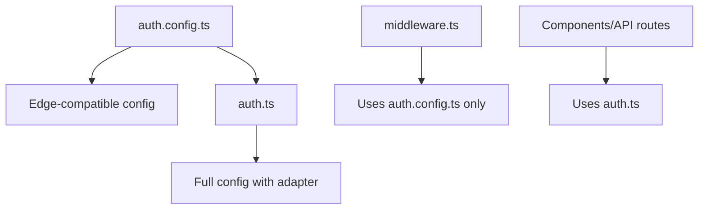

# NextAuth.js v5 Migration Guide

**Date:** April 12, 2025

## Overview

This guide outlines the process for migrating from NextAuth.js v4 to NextAuth.js v5 in the Tennessee Justice Bus application. The migration is designed to leverage the new features while ensuring compatibility with our Edge deployment requirements.

## Key Changes in NextAuth.js v5

1. **Universal `auth()` Function**: Replaces various authentication methods (`getServerSession`, `getToken`, etc.)
2. **Configuration Structure**: Moved from API routes to a root-level configuration file
3. **Edge Compatibility**: Improved support for Edge runtimes
4. **Adapter Changes**: Package name changes from `@next-auth/*-adapter` to `@auth/*-adapter`
5. **Cookie Prefix Changes**: Renamed from `next-auth` to `authjs`
6. **Environment Variables**: Renamed from `NEXTAUTH_` to `AUTH_` prefix

## Migration Strategy for Edge Compatibility

To maintain compatibility with Edge runtimes while using adapters that may not be fully Edge-compatible, we'll implement a split configuration approach:



## Implementation Steps

### 1. Install Updated Packages

```bash
pnpm add next-auth@beta @auth/supabase-adapter
```

### 2. Create Edge-Compatible Configuration

Create an `auth.config.ts` file in the project root with configurations that can run in Edge environments:

```typescript
// auth.config.ts
import type { NextAuthConfig } from "next-auth";
import EmailProvider from "next-auth/providers/email";
import CredentialsProvider from "next-auth/providers/credentials";

export default {
  providers: [
    EmailProvider({
      server: process.env.EMAIL_SERVER || "",
      from: process.env.EMAIL_FROM || "noreply@tnjusticebus.org",
    }),
    CredentialsProvider({
      name: "Phone Number",
      credentials: {
        phone: { label: "Phone Number", type: "tel" },
        code: { label: "Verification Code", type: "text" },
      },
      async authorize(credentials) {
        if (!credentials?.phone || !credentials.code) return null;

        // Simple validation for edge compatibility
        const isValidCode =
          credentials.code.length === 6 && /^\d+$/.test(credentials.code);

        if (!isValidCode) return null;

        // The actual user lookup and creation happens in auth.ts
        return {
          id: "edge-auth-placeholder",
          phone: credentials.phone,
        };
      },
    }),
  ],
  callbacks: {
    authorized({ auth, request: { nextUrl } }) {
      const isLoggedIn = !!auth?.user;

      // Public paths that don't require authentication
      const publicPaths = [
        "/",
        "/auth/signin",
        "/auth/signup",
        "/auth/verify",
        "/auth/error",
        "/api/auth",
        "/offline",
      ];

      const isPublicPath = publicPaths.some((path) =>
        nextUrl.pathname.startsWith(path)
      );

      if (isPublicPath) return true;

      return isLoggedIn;
    },
    jwt({ token, user }) {
      if (user) {
        token.id = user.id;
        token.phone = user.phone;
        token.email = user.email;
      }

      if (!token.iat) {
        token.iat = Math.floor(Date.now() / 1000);
      }

      return token;
    },
    session({ session, token }) {
      if (token && session.user) {
        session.user.id = token.id as string;

        if (token.phone) {
          session.user.phone = token.phone as string;
        }

        if (token.email) {
          session.user.email = token.email as string;
        }
      }
      return session;
    },
  },
  pages: {
    signIn: "/auth/signin",
    signOut: "/auth/signout",
    error: "/auth/error",
    verifyRequest: "/auth/verify",
  },
  session: {
    strategy: "jwt",
    maxAge: 30 * 24 * 60 * 60, // 30 days
  },
} satisfies NextAuthConfig;
```

### 3. Create Main Auth Configuration File

Create an `auth.ts` file in the project root that extends the edge-compatible configuration with database-specific features:

```typescript
// auth.ts
import NextAuth from "next-auth";
import { SupabaseAdapter } from "@auth/supabase-adapter";
import { db } from "@/lib/db";
import { eq } from "drizzle-orm";
import { users } from "@/db/schema";
import authConfig from "./auth.config";

// Initialize Supabase client for auth operations
const supabaseUrl = process.env.SUPABASE_URL!;
const supabaseServiceRoleKey = process.env.SUPABASE_SERVICE_ROLE_KEY!;

export const { auth, handlers, signIn, signOut } = NextAuth({
  ...authConfig,
  adapter: SupabaseAdapter({
    url: supabaseUrl,
    secret: supabaseServiceRoleKey,
  }),
  providers: [
    // Keep EmailProvider as is from authConfig
    authConfig.providers[0],
    // Override the CredentialsProvider to include database operations
    {
      id: "credentials",
      name: "Phone Number",
      type: "credentials",
      credentials: {
        phone: { label: "Phone Number", type: "tel" },
        code: { label: "Verification Code", type: "text" },
      },
      async authorize(credentials) {
        if (!credentials?.phone || !credentials.code) return null;

        try {
          // In a real application, we would verify the code against a stored code
          // For development, we'll validate any 6-digit code format
          const isValidCode =
            credentials.code.length === 6 && /^\d+$/.test(credentials.code);
          if (!isValidCode) return null;

          // Find the user by phone number
          const user = await db.query.users.findFirst({
            where: eq(users.phone, credentials.phone),
          });

          if (!user) {
            // Create a new user if they don't exist
            const [newUser] = await db
              .insert(users)
              .values({
                phone: credentials.phone,
                preferredContactMethod: "phone",
              })
              .returning();

            return {
              id: newUser.id,
              phone: newUser.phone || "",
              email: newUser.email || "",
              name: newUser.firstName
                ? `${newUser.firstName} ${newUser.lastName || ""}`
                : undefined,
            };
          }

          return {
            id: user.id,
            email: user.email || "",
            phone: user.phone || "",
            name: user.firstName
              ? `${user.firstName} ${user.lastName || ""}`
              : undefined,
          };
        } catch (error) {
          console.error("Authentication error:", error);
          return null;
        }
      },
    },
  ],
  events: {
    async signIn({ user }) {
      // Update last_login timestamp
      if (user?.id) {
        try {
          await db
            .update(users)
            .set({ lastLogin: new Date() })
            .where(eq(users.id, user.id));
        } catch (error) {
          console.error("Error updating last login:", error);
        }
      }
    },
  },
  // Debug is helpful during development
  debug: process.env.NODE_ENV === "development",
});
```

### 4. Update API Route Handler

Update the `src/app/api/auth/[...nextauth]/route.ts` file to use the exported handlers:

```typescript
// src/app/api/auth/[...nextauth]/route.ts
import { handlers } from "@/auth";
export const { GET, POST } = handlers;
```

### 5. Update Middleware

Update the `middleware.ts` file to use only the edge-compatible configuration:

```typescript
// middleware.ts
import authConfig from "./auth.config";
import NextAuth from "next-auth";

export const { auth } = NextAuth(authConfig);

// Export the middleware function
export default auth((req) => {
  // The authorized callback in authConfig handles the logic now
});

export const config = {
  matcher: ["/((?!_next/static|_next/image|favicon.ico|.*\\.svg).*)"],
};
```

### 6. Update TypeScript Type Definitions

Update the types in `src/types/next-auth.d.ts` to ensure compatibility with NextAuth.js v5:

```typescript
// src/types/next-auth.d.ts
import { DefaultSession } from "next-auth";

declare module "next-auth" {
  interface Session {
    user: {
      id: string;
      phone?: string;
    } & DefaultSession["user"];
  }

  interface User {
    phone?: string;
  }
}

declare module "next-auth/jwt" {
  interface JWT {
    id: string;
    phone?: string;
  }
}
```

### 7. Update Environment Variables

Update the environment variables in your `.env` files:

```
# Old variables
NEXTAUTH_SECRET=your-secret
NEXTAUTH_URL=https://your-site.com

# New variables
AUTH_SECRET=your-secret
# AUTH_URL is optional, will be auto-detected
```

### 8. Update Server Component Authentication

Update any server components that use `getServerSession`:

```typescript
// Before
import { getServerSession } from "next-auth/next";
import { authOptions } from "@/app/api/auth/auth";

// After
import { auth } from "@/auth";

// Usage
const session = await auth();
```

### 9. Update Client Components (if necessary)

Client components using `useSession` from `next-auth/react` should continue to work with minimal changes:

```typescript
// client-component.tsx
'use client';

import { useSession } from "next-auth/react"

export default function ProfileComponent() {
  const { data: session } = useSession()

  return (
    <div>
      <h1>Profile</h1>
      {session ? (
        <p>Logged in as: {session.user.phone || session.user.email}</p>
      ) : (
        <p>Not logged in</p>
      )}
    </div>
  )
}
```

## Testing the Migration

Test the migration using this checklist:

1. **Authentication Flow**:

   - Email sign-in with magic links
   - Phone number sign-in with verification codes
   - Sign-out functionality
   - Session persistence
   - Token expiration

2. **Protected Routes**:

   - Access to dashboard when authenticated
   - Redirect to sign-in when not authenticated
   - Public routes accessible without authentication

3. **Edge Compatibility**:

   - Middleware functions correctly
   - Authentication in server components
   - Authentication in client components

4. **Offline Functionality**:
   - Session persistence during offline periods
   - Reconnection handling

## Troubleshooting

### Session Cookie Issues

If users are unexpectedly logged out or session cookies aren't working:

1. Check cookie prefixes (changed from `next-auth` to `authjs`)
2. Verify session strategy is set to `jwt` for offline support
3. Ensure JWT callback properly includes user information

### Edge Compatibility Issues

If encountering errors in Edge environments:

1. Verify `auth.config.ts` only uses edge-compatible code
2. Ensure database operations are limited to non-Edge contexts
3. Check middleware only imports from `auth.config.ts`

### Type Errors

If facing TypeScript errors:

1. Update imports from `next-auth` to use the correct types
2. Replace `NextAuthOptions` with `NextAuthConfig`
3. Ensure your session and JWT interface extensions are correct

## Rollback Plan

If critical issues arise during migration:

1. Restore previous authentication files:
   - `src/app/api/auth/auth.ts`
   - `src/app/api/auth/[...nextauth]/route.ts`
   - `middleware.ts`
2. Revert package changes:

   ```bash
   pnpm remove next-auth@beta @auth/supabase-adapter
   pnpm add next-auth@4 @next-auth/supabase-adapter
   ```

3. Restore original environment variables

## References

- [Official NextAuth.js v5 Migration Guide](https://authjs.dev/guides/migrate-to-v5)
- [NextAuth.js v5 Edge Compatibility](https://authjs.dev/concepts/edge-compatibility)
- [NextAuth.js v5 Configuration Reference](https://authjs.dev/reference/core)
